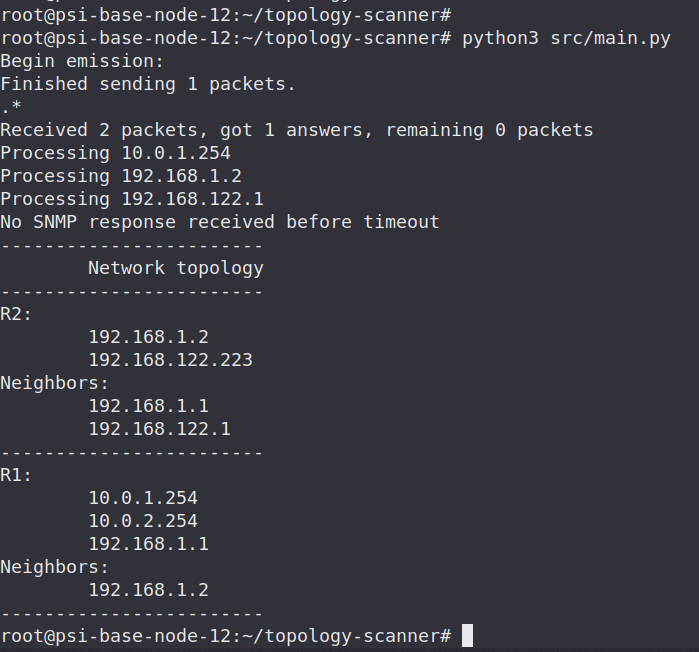

# Topology scanner

This application is a simple network topology scanner based on SNMP and DHCP. It tries to find all available routers in the network and prints information about their interfaces and neighbors. End nodes such as PC's and other devices are not looked up.

## Prerequisites
To use this script, your network needs to have a DHCP server set up. Also, all routers need to have SNPM enabled and configured with communityIndex as `PSIPUB`.

To use this application make sure you have all your repositories up to date and have git installed. To ensure all of this you can simply run

```bash
apt update && \
  apt upgrade -y && \
  apt install git -y
```

Once these prerequisites are met you may clone this repository by running
```bash
git clone https://github.com/markovd18/topology-scanner.git
```
Then you may proceed and `cd` into the project root directory.

Since this application uses python libraries as dependencies, one also needs to have `pip` installed. Internally, for network communication and scanning purposes the `scapy` and `pysnmp` libraries are used. As a set up, go ahead and run the following command in the project root or simply execute `init.bash` script which executes the same:

```bash
apt install pip -y && \
  pip install pysnmp && \
  pip uninstall pyasn1 -y && \
  pip install pyasn1==0.4.8
```
If you do not have `scapy` installed, also run
```bash
pip install scapy
```

## Usage
After prerequisites are met you may go ahead and execute the application by running 
```bash
python3 src/main.py
```
in project root. Application takes no arguments from the CLI.

## Example

In the example above, the application is executed on a base node in a network with two routers:
- R1 serves as a NAT gateway to outer network
- R1 serves as a separator of two local networks by it's two interfaces.
  
Scanner was able to identify both routers in the network, their hostnames, interface IP addresses and also note their neighbors.

## Implementation caveats
When executing on an end node, scanner first discovers an IP address of router which is pointed to by the device's default gateway using a DHCP Discover packet. From DHCP Offer response it is able to retrieve routers address. This lookup is implemented in `src/dhcp.py` module.

Application then recursively scans all routers by sending specific SNMP messages to them. Initially, a request for routing table next hop's is issued. Then, a request for all router's IP addresses is sent, resulting in addresses of all it's interfaces. All of these are deleted from the list of routing table entries since we do not need to consider them in the scanning process. Last but not least, a host name of the router is retrieved for later usage in displaying topology information. All of SNMP communication is encapsulated in `src/snmp.py` module.